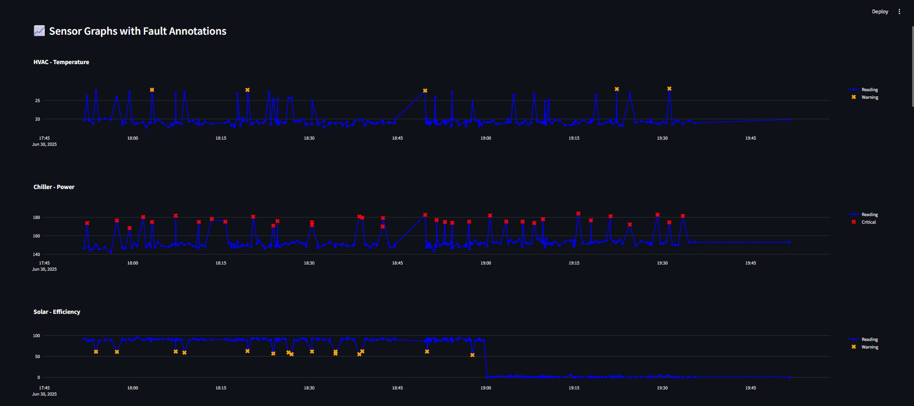
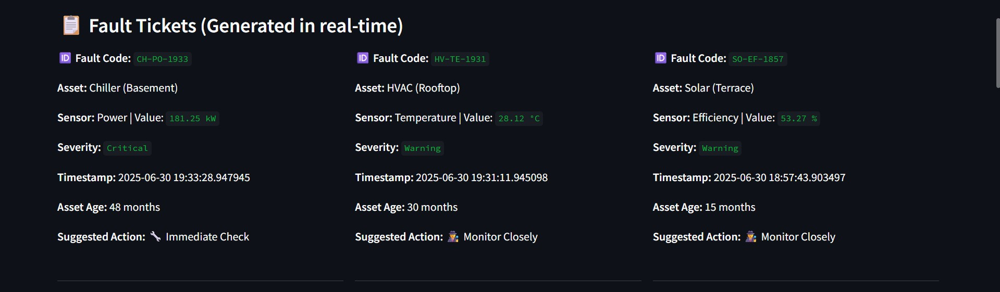
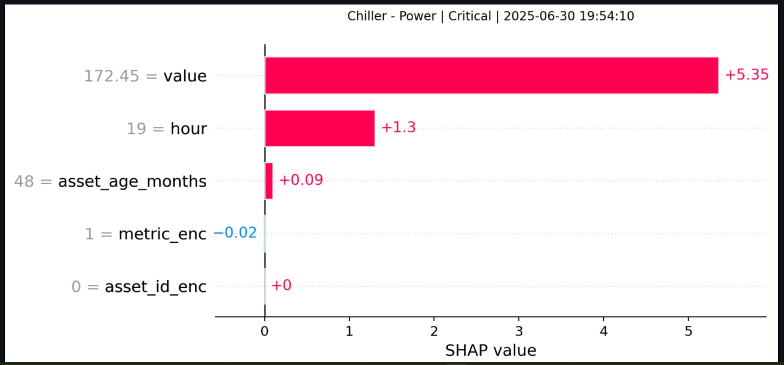

<h1>🏭 Smart Asset Fault Detection Dashboard</h1>
<h3>AI-Powered Live Fault Detection for Smart Asset Monitoring</h3>

  
  
  

  Xempla Fault Detection is a real-time asset health monitoring dashboard that uses <strong>XGBoost</strong> and <strong>SHAP</strong> explainability to identify faults in critical systems like HVAC, Chillers, and Solar Panels. The system simulates sensor data, detects anomalies, classifies fault severity, and provides interpretable diagnostics using <strong>SHAP plots</strong>.

<h2>📌 Disclaimer</h2>

  ⚠️ <strong>Note:</strong> The current dashboard runs on simulated sensor data with random anomaly injection for testing purposes. Once connected to real IoT sensors, the same logic will work with live industrial data.

<h2>🚀 Live Demo</h2>

👉 <a href="https://smart-asset-management.streamlit.app/" target="_blank">Launch the App</a>

<h2>🔧 Features</h2>
<ul>
  <li>📊 Live sensor data visualization with fault markers</li>
  <li>🤖 Fault classification using XGBoost with severity labels</li>
  <li>🪪 Auto-generation of fault tickets with metadata</li>
  <li>📌 Real-time SHAP explainability per asset's latest fault</li>
  <li>📅 Time-range based dynamic filtering (1, 3, or 7 days)</li>
  <li>🕒 Always shows the last 3 hours of available data per asset</li>
</ul>

<h2>📂 Project Structure</h2>
<pre><code>
Xempla-Fault-Detection/
│
├── app.py                       # Main Streamlit dashboard
├── train_model.py               # XGBoost model training script
├── xgboost_model.pkl            # Trained XGBoost model
├── le_asset.pkl                 # LabelEncoder for asset_id
├── le_metric.pkl                # LabelEncoder for metric
├── asset_metadata.csv           # Metadata (age, location) of assets
├── multi_asset_data.csv         # Simulated sensor data
├── fault_tickets.csv            # Logs of detected fault tickets
└── requirements.txt             # Python dependencies
</code></pre>

<h2>📊 How it Works</h2>

The dashboard simulates live readings from three assets — <strong>HVAC</strong>, <strong>Chiller</strong>, and <strong>Solar Panel</strong> — and uses an XGBoost classifier to detect and classify faults into:

<ul>
  <li>Normal</li>
  <li>Warning</li>
  <li>Critical</li>
</ul>

Upon detecting a fault, the app logs it with metadata, generates a fault ticket, and explains the model's prediction using SHAP bar plots.

<h2>⚙️ How to Run Locally</h2>

<h4>📦 Step 1: Clone the Repository</h4>
<pre><code>git clone https://github.com/SreedeepGhosh/Smart-Asset-Management.git
cd Smart-Asset-Management</code></pre>

<h4>🧱 Step 2: Install Dependencies</h4>
<pre><code>pip install -r requirements.txt</code></pre>

<h4>🚀 Step 3: Launch the Streamlit App</h4>
<pre><code>streamlit run app.py</code></pre>

<h2>📈 Screenshots</h2>
<table>
  <tr>
    <th>📉 Real-time Charts</th>
    <th>📋 Fault Tickets</th>
  </tr>
  <tr>
    <td></td>
    <td></td>
  </tr>
</table>

<table>
  <tr>
    <th>🧠 SHAP Explainability</th>
  </tr>
  <tr>
    <td></td>
  </tr>
</table>

<h2>🛠 Built With</h2>
<ul>
  <li><strong>Python</strong> 🐍</li>
  <li><strong>Streamlit</strong> 📈</li>
  <li><strong>XGBoost</strong> ⚙️</li>
  <li><strong>SHAP</strong> 🧠</li>
  <li><strong>Pandas & Plotly</strong> 📊</li>
</ul>

<h2>📜 License</h2>

This project is licensed under the <a href="LICENSE">MIT License</a>.

<h2>👤 Author</h2>
<ul>
  <li><strong>GitHub:</strong> <a href="https://github.com/SreedeepGhosh" target="_blank">Sreedeep Ghosh</a></li>
  <li><strong>Email:</strong> sreedeepghosh2003@gmail.com</li>
  <li><strong>LinkedIn:</strong> <a href="https://linkedin.com/in/sreedeep-ghosh-8309b4273" target="_blank">Sreedeep Ghosh</a></li>
</ul>

<h2>🌟 Support</h2>

⭐ Star this repository if you found it useful! 
💬 Raise an issue or pull request for suggestions or improvements.

